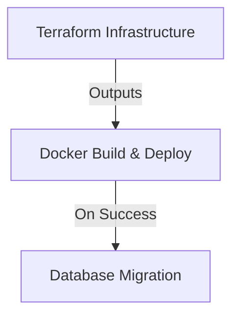

# GitHub Actions Workflows Documentation

This repository uses three GitHub Actions workflows to automate the deployment and migration process for the Cloud Migration project. The workflows are designed to work in sequence:

1. **Terraform Infrastructure**  
   Provisions and configures all required Azure resources.

2. **Docker Build and Deploy to Azure Container Registry**  
   Builds the container image for the application, pushes it to Azure Container Registry (ACR), and configures the Azure App Service for container deployment.

3. **Migrate MySQL Database to Azure Database for MySQL Flexible Server**  
   Applies firewall rules for access, downloads the required SSL certificate, and performs the database migration to Azure Database for MySQL Flexible Server.

---
## Prerequisites

### Azure Service Principal
1. Login to Azure:
```powershell
az login
az account show --query id -o tsv
```

2. Create service principal:
```powershell
az ad sp create-for-rbac --name "github-actions" --role contributor --scope /subscriptions/<subscription-id>
```
**Note:** Use the JSON output from this command (or reset credentials) and store it as GitHub secrets.

### GitHub Secrets Required

- `AZURE_CREDENTIALS`: Full JSON output from service principal creation
- `AZURE_CLIENT_ID`: Service principal's client ID (appId)
- `AZURE_CLIENT_SECRET`: Service principal's client secret 
- `MYSQL_ADMIN_USERNAME`: MySQL admin username
- `MYSQL_ADMIN_PASSWORD`: MySQL admin password

- **Other Requirements:**  
  Ensure the following tools are installed in your environment when testing locally:
  - [Terraform](https://www.terraform.io/)
  - [Docker](https://www.docker.com/)
  - [Azure CLI](https://docs.microsoft.com/en-us/cli/azure/)

---

## Workflow Execution Order
The workflows run sequentially with outputs from the previous steps used as inputs for subsequent jobs:



## Workflow Details

### 1. Terraform Infrastructure
- **File**: `terraform-infrastructure.yaml`
- **Triggers**: 
  - On Push to main branch (`*.tf` files)
  - On Pull requests
  - Manually via workflow_dispatch  
- **Functions**:
  - Bootstrap state storage
  - Create and configures Azure resources
  - Output resource information (e.g., ACR name, resource group, App Service details)

### 2. Docker Build & Deploy
- **File**: `docker-build-deploy.yaml`
- **Triggers**:
  - On completion of the Terraform Infrastructure workflow
  - Push to main (`app.py` and `Dockerfile`) 
  - Manual dispatch
- **Functions**:
  - Downloads Terraform outputs  
  - Logs in to Azure and ACR  
  - Grants the necessary role assignments for the App Service to pull images (using the AcrPull role)  
  - Builds the Docker image and pushes it to ACR  
  - Configures the Azure App Service container settings

### 3. Database Migration
- **File**: `az-db-mysql.yaml`
- **Triggers**:
     - On completion of the Docker Build and Deploy workflow  
     - Manually via workflow_dispatch 
- **Functions**:
     - Downloads Terraform outputs to retrieve MySQL server details  
     - Logs in to Azure  
     - Retrieves the current public IP and creates a firewall rule on the Azure MySQL Flexible Server  
     - Downloads the required SSL certificate  
     - Installs the MySQL client and runs the database migration script

## Common Issues & Troubleshooting

1. **Azure Authentication Errors:**
   - Ensure service principal has adequate permissions
   - Verify secret values are correct
   - Check credential expiration

2. **Role Assignment Failures:**  
   - Role assignments are performed (e.g., granting the AcrPull role to the App Service managed identity) within the Docker workflow. 
   - Verify that the outputs from Terraform are parsed correctly and that the required roles have propagated in Azure.

3. **Build & Deployment Failures:**  
   - Validate that Docker is set up correctly in the CI environment, and that your application’s Dockerfile builds without errors locally.


4. **Database Migration Issues:**  
   - Make sure the current IP is properly captured in the workflow.
   - Verify that the MySQL Flexible Server firewall is updated.
   - Ensure the SSL certificate is successfully downloaded.
   - Check that the on-premise database dump (`onprem_db.sql`) is available in the expected directory.

5. **Workflow Dependencies**
   - Ensure artifacts are shared correctly
   - Verify output parsing
   - Check environment variables

## Monitoring & Troubleshooting

- View workflow runs in GitHub Actions tab
- Check Azure Portal for resource status
- Monitor MySQL server logs
- Verify App Service deployment logs

## Contributing

1. Create a feature branch.
2. Update workflow files if necessary.
3. Test changes locally and via manual dispatch (using `workflow_dispatch` inputs).
3. Submit pull request for review.

---

This documentation provides you with a concise overview of the workflows, their dependencies, and common solutions to issues that may arise. For further details, refer to the inline comments within each workflow file.